# Java基础

九九乘法表：两层for循环 四个方向，八种情况，1 * 1 和 9 * 9 只能在两锐角处

判断是否是质数：1）标签法 2）break

## 使用命令行编译java源文件

在源文件没有引入其他包的情况下：

在命令行中进入到源文件的路径，使用**javac 源文件名.java**，生成.class编译后的字节码文件

运行：直接输入java 字节码文件名 即可，不需要加.class

在源文件引入其他包的情况下：

在命令行中进入到源文件的路径，使用**javac -encoding utf-8 -d  . 源文件名.java**,生成.class编译后的字节码文件.

运行：输入java package.xxxx

## 八大基本数据类型

整型（没有小数点的）：

​	byte：字节型 （-127，128） 1byte=8bit(字节) java存储的基本单位

​	short：短整型（-32768，32767）2byte

​	int：整形（-20亿，20亿）默认		4byte

​	long：长整型									8byte

浮点型：（有小数）

​	float：		小数点后6~8位				4byte			f/F

​	double：	小数点后12位				8byte 		默认

字符型：

​	char：												2byte

布尔型：

​	boolean												1byte

## 数据类型转换

1、高精度=低精度

自动将低精度转化为高精度。

2、byte/short/char=int

编译器会判断左边变量是否能装下右边的值，能就转换后赋值，不能就报错。

3、低精度=高精度

报错，需要高精度强转为低精度，会造成精度丢失。

## 逻辑运算符

只能操作boolean数据，结果是boolean类型的数据

& 单与

&& 双与

| 单或

|| 双或

^ 异或	两边不同即为true，不同即为false

！ 取反

**逻辑运算符 单 双 的区别**

单可以作为位运算符，操作的是数字的二进制。

双存在逻辑短路：

|| 如果判断前面的为true，那么就直接返回true不会再去判断后面的结果。同样&& 如果判断前面的为false，直接返回false，不会再判断后面的结果。

## if-else

1、水仙花数：是三位数，并且各个位数的值的三次方之和等于此数

2、判断是不是闰年

3、根据月份判断季节

4、根据年龄和性别 判断称呼

## switch

格式：

switch(表达式){

​	case 值1：

​		表达式为1时执行的代码;

​		break；

​	............

​	default:

​		值都不是上面的时，执行的代码

​	break;

}

1、switch只适用于穷举法，需要列出所有的情况。

2、switch支持6种数据类型：

jdk5之前只支持byte、short、int、char；jdk5之后支持枚举Enum；jdk7之后支持String（string的包装类）

为什么switch不支持long类型？

因为switch其实只支持int类型，但是byte、short、char在编译时会自动转换为int。

那为什么switch会支持String呢？

编译器会根据字符串的hachcode来进行处理，编译时会将该块代码分为两个switch代码，第一个switch会根据hashcode来计算得到当前参数值在第二个switch中对应的位置，第二个switch和原来的switch逻辑一样。

其实就是

## 循环

1、while循环

while(表达式){

​	成立时执行的代码；

}

2、do-while

do{

成立时执行的代码;

}while(条件判断)

条件判断再程序执行之后

3、for

for（条件判断）{

​	成立时执行的代码；

}

与while完全等价。

九九乘法表

## break和continue

都表示跳转。

break：

结束switch结构，结束本次循环。

continue：

用在循环体中，跳过本次循环，继续执行下次循环。

## 数组

**只能存放定义时就指定好的8大基本数据类型之一的数据。**

创建数组的三种方式：

1、int[] arr=new int[10];

2、int[] arr=new int[]{1,2,3};

3、int[] arr={1,2,3};

## 数组排序

1、顺序排序 :以此拿当前元素和他后面的所有元素作比较

外层for循环：当前元素

内层for循环：后面的所有元素

``` java
int[] arr={2，34，4，54，90};

for(int i=0;i<arr.length-1;i++){

	for(int j=i+1;j<arr.length;j++){

		if(arr[i]>arr[j]){

			int k=arr[i];

			arr[i]=arr[j];

			arr[j]=k;

}

}

}
```

2、冒泡排序：依次拿相邻元素作比较

外层for循环：轮数

内层for循环：相邻元素的前一个元素，-i是因为每轮比较之后都会在最后面得出最大值或者最小值，他们已经有了顺序不需要再进行比较。

``` java
for(int i=0;i<arr.length-1;i++){

	for(int j=0;j<arr.length-i-1;j++){

		if(arr[j]>arr[j+1]){

			int k=arr[j];

			arr[j]=arr[j+1];

			arr[j+1]=k;

}

}

}
```

3、插入排序：从第二个元素开始依次和前面的元素进行比较，符合满足条件就交换，直到不满足条件就说明该元素找到正确的位置。

``` java
for(int i=1;i<arr.length;i++){

	for(int j=i;j>0;j--){

		if(arr[j]<arr[j-1]){

			int k=arr[j];

			arr[j]=arr[j-1];

			arr[j-1]=k;

}else{

	break;

}		

}

}
```


## 二维数组

``` java
创建二维数组三种方式：
1
int [][] arr = new int [2][2];

2
int [][] arr = new int [][] { {1,1},{2,2} };

3
int [][] arr = { {1,1},{2,2} };
```

遍历二维数组：两层for循环

``` java
for(int i=0;i<arr.length;i++){

	for(int j=0;j<arr[i].length;j++){

		System.out.print(arr[i] [j]);

}

System.out.println();

}
```

打印**杨辉三角**

~~~ java
		 * 1
		 * 1 1 
		 * 1 2 1 
		 * 1 3 3 1 
		 * 1 4 6 4 1 
		 * 1 5 10 10 5 1 
		 * 1 6 15 20 15 6 1
~~~

特点：

1、第一列和每行的最后一个数字都是1，其他的都是上面的数和上面的左边的数的和。

2、第一行一个，第二行二个，第三行三个···················

~~~ java
int [][] arr=new int[10][];
for(int i=0;i<10;i++){//控制行
    int[] arr1=new int[i+1];//第 i+1 行有i+1 个元素
    for(int j=0;j<arr[i].length;j++){
        if(j==0 || j==arr1[i].length-1){
            arr[i][j]=1;
        }else{
            arr[i][j]=arr[i-1][j]+arr[i-1][j-1];
        }
    }
}

打印二维数组
for(int i=0;i<arr.length;i++){
    for(int j=0;j<arr[i].length;j++){
        System.out.print(arr[i][j]+(j==arr[i].length-1?"\n":"\t"));
    }
}
~~~

## 方法递归

输出斐波那契数列:

递归法：用时间换空间

时间复杂度：O(2^n) 	空间复杂度：O(n)

~~~ java
public int Feibonaqi(int n){
    if(n==0)
        return 0;
    if(n==1)
        return 1;
    return Feibonaqi(n-2)+Feibonaqi(n-1);
}
~~~

循环法：用空间换时间

时间复杂度：O(n)	空间复杂度：O(1)

~~~ java
public int Xunhuan(int n){
    if(n<2)
        return n;
    int f=0,g=1,result=0;
    for(int i=1;i<n;i++){
        result=f+g;
        f=g;
        g=result;
    }
    return result;
    
}
~~~

# oop

Object Oriented Programming

## 方法重载 

overload

在**一个类**中，存在几个**方法名相同**，**参数列表不同**的方法，这种现象叫做方法重载。

什么是参数列表不同？

参数类型不同，个数不同，顺序不同

重载的方法之间互不影响，只是用参数列表进行区分开。

## 方法重写

override

子类继承父类时，在子类中定义一个和父类中存在的完全相同的方法。

完全相同指的是：返回值、方法名、参数列表完全相同，修饰符可以相同或者扩大，抛出的异常可以少或者没有。

子类重写父类的方法后，父类的方法会被隐藏。

## 构造方法

又叫构造器、构造函数，关键字是 Constructor，作用只有一个，那就是创建对象。

特点：

1、没有返回值，并且不需要用void标识

2、名字必须和类名相同

3、不能被对象调用

4、只能被new关键字调用，并且没调用一次就必定创建一个对象

5、一个类如果没有构造方法，那么就默认有一个没有参数的构造方法

6、构造方法的参数列表一般是给参数赋初始值的

## this

this两个使用场景：

1、成员变量和局部变量重名时，根据就近原则，变量默认指向的是局部变量，使用this.修饰变量，可以使变量指向成员变量。

2、有多个构造方法时，用this.(参数列表)调用对应参数列表的构造方法。但是这个语句必须是第一段代码。

## supper

supper两个使用场景

1、子类重写父类的成员（变量或方法），子类中从父类继承的成员会被隐藏，在子类中通过supper.成员调用被隐藏的成员。在子类方法中所有的子类成员前面默认有supper.

2、子类的构造方法的第一个语句并须是super(参数列表)来调用父类的构造方法，如果没有就默认是super()，调用父类的无参构造的方法。

为什么要有super(参数列表)来调用父类的构造方法？

因为子类创建对象时，需要把父类的对象加载进子类内存。

## 构造方法与普通方法的区别

定义：

构造方法：类中用于创建对象的方法。

普通方法：类中定义的具有特定功能的代码块。

相同之处：都是方法，都是类的成员。

不同之处：

1、格式不同：普通方法必须有返回值类型的标识，没有返回值用void标识。构造方法没有返回值，同时也不用void标识。

2、调用不同：普通方法被对象调用，一个对象可以调用多次。构造方法只能被new关键字调用，调用一次就创建一个对象。

3、是否有默认：一个类如果没有构造方法，就默认有一个无参数的构造方法。普通方法则没有默认。

4、命名不同：构造方法名必须是类名，普通方法名没有要求，可以是类名，但是不规范。

5、作用不用：构造方法是用来创建对象的，普通方法代表是类创建的对象的功能。

## 创建对象内存图

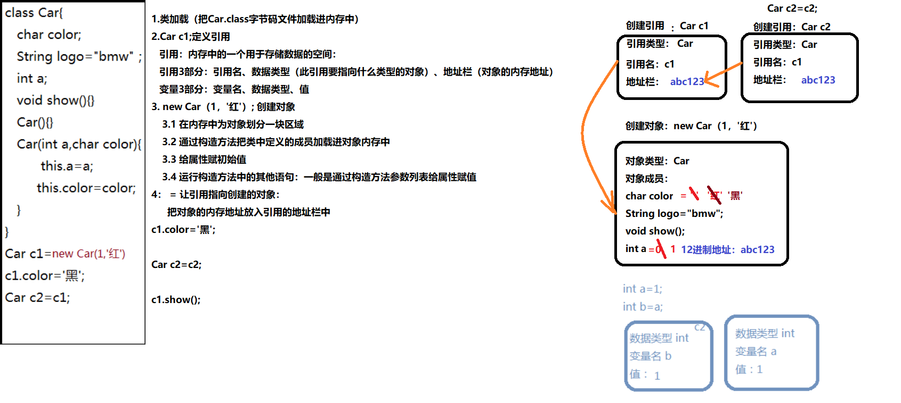

## private属性私有化封装

封装是对实现细节进行包装隐藏。

用private来修饰属性，那么该属性就只能在本类中访问。要想实现让外部类也能访问到这些属性，就需要在本类中创建公共类型的getter/setter方法，来对属性进行间接获取和创建。

## static 静态

static修饰符可以修饰内部类、代码块、成员变量、普通方法。

静态内部类：

静态代码块：

静态变量（类变量）：1、能用类名直接调用。2、是类的共享数据，所有对象公用一个。

静态方法（类方法）：1、能用类名直接调用。2、静态方法只能调用静态成员。（非静态方法可以调用所有成员。）

静态变量的场景：当数据不是属于某一个对象而是所有对象公用时，将改数据变量定义为静态变量。

静态方法的场景：当方法中不涉及非静态成员时，就尽量定义成静态方法。

所有的静态的东西都在内存中的静态区域中，当类加载时就直接加载他们。

## 静态内存图

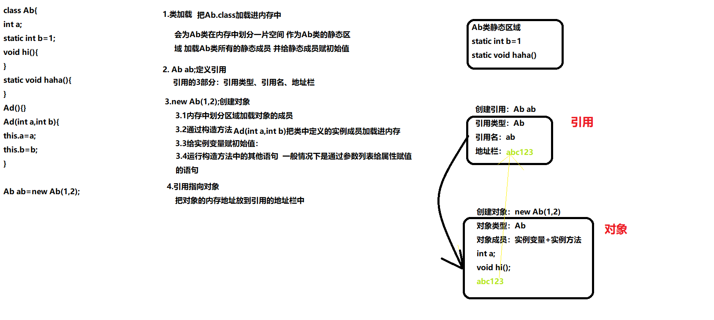

## 继承extends

概念：当定义一个新类时，发现该类拥有一个现有的类中的所有成员，那么就可以让该类从那个现有的类中派生、衍生出一个新类。

新类被称为子类，现有的类被称为父类、超类、根类。

继承的作用：

1、实现类的复用

2、创建类与类之间的关系


继承的特点：

1、子类会继承父类所有的成员。

2、子类会继承父类的私有成员，但是不能直接调用，需要通过反射来调用。

3、子类不能继承父类的构造方法。

4、子类中可以定义父类中没有的成员（子类特有）。

5、java只支持类与类的单继承，一个子类只能有一个直接父类。但可以有多个间接父类，所有的方法都间接或者直接继承顶层父类Object类。

6、子类可以根据自己的实际需求对父类的方法进行重写，重写必须返回值、方法名】参数列表都相同。

7、**静态方法不能被重写**，因为静态方法在类加载时就已经继承过来了。但是也可以在自己的类中定义一个一模一样的方法，达到重写的效果，实际上就是一个就近原则的问题。

**重定义**：在子类与父类中，子类中的方法名和父类中的方法名相同，但是参数列表或者返回值不相同（如果参数列表和返回值也都和父类中的方法相同，那直接就是重写了），

## 继承内存图

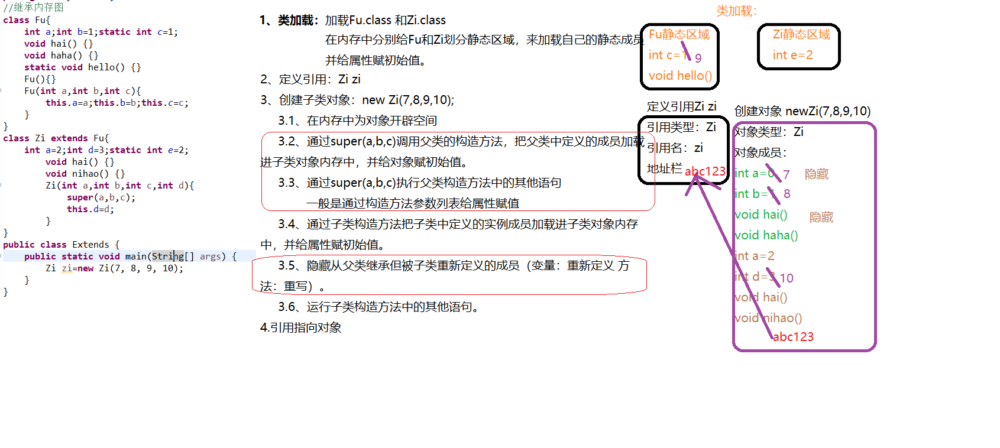

## 重载和重写的区别

1、重载发生在一个类中，是一个类中几个方法名相同参数列表不同的现象；重写发生在有继承关系的两个类中，子类的方法和父类的方法方法名参数列表返回值完全相同，范围修饰符可以扩大，抛出的异常可以更少或者没有。

2、重载的方法之间其实没有特别的关系，只是名字相同，但是可以通过参数列表进行区分；但是子类重写父类的方法会把父类的方法进行隐藏。

## 范围修饰符

让被修饰者具备一些它本身所没有的特征。

表示作用范围，可以修饰类（public、default（省略的））、成员变量、方法：


public：		公共的	整个项目

protected： 受保护的	本包+本类的子类

default：	 省略的	本包

private：	 私有的	本类

### 修饰类的只有public或者省略的default

也就是说类的作用范围只能是本包或者整个项目。

## final

最终的

类、成员方法、成员变量、局部变量

final 类：不能被继承

final 方法：不能被重写

final 变量：相当于常量 值不能被修改

final常量命名规范：所有字母大写，单词之间用下划线隔开

**final修饰的变量没有初始值**

## 静态final变量（也就是静态常量）初始化的方式


1、变量初始化时赋值：

~~~ java
static final int a=10;
~~~

2、通过静态代码块赋值

~~~ java
final static int a;
static{
    a=10;
}
~~~

为什么不能用构造方法初始化静态变量的值？

因为静态变量是随着类加载时加载的，而构造方法是创建对象时才调用的，创建对象在类加载之后，所以构造方法不能初始化静态变量。

## 成员变量和局部变量的区别

1、成员变量是在类中定义的的，局部变量实在方法中定义的变量或者是方法的参数。

2、成员变量可以被public、private、static、protected、final访问控制修饰符修饰，但是局部变量只能被final修饰。

3、成员变量是对象的一部分，而对象存在于堆内存中，局部变量存在于栈内存。

4、从变量在内存中的生存时间来看，成员变量是对象的一部分，它随着对象的创建而存在，而局部变量随着方法的调用而存在并消失。

5、成员变量有默认值（被final修饰但没有被static修饰的变量除外），局部变量没有默认值。

final static 修饰的变量必须在定义时初始化或者在静态代码块中初始化。

## 抽象 关键字abstract

修饰符，只能修饰类或者对象

特点：

1、抽象类中可以有抽象方法也可以有普通方法，也就是说有抽象方法的类一定是抽象类，但抽象方法不一定有抽象类。

2、抽象类有构造方法，但是他的构造方法不是用来创建对象，而是帮助子类创建对象的（在创建对象时，把抽象类中非抽象方法和成员变量加载进子类内存）。

3、抽象类的子类除非重写全部的抽象方法，否则其子类还是抽象类。

4、抽象方法不能有方法体。

## 多态 

父类引用指向子类对象。

从编译器角度讲，多态依赖于不同的派生类有相同的指针类型，所以创建一个类时可以指向他的基类。

优点：

在调用层想要修改一个功能的具体行为时，只需要再派生一个类或者修改派生类就行，父类接口不需要修改，可以减少代码的改动量。

缺点：对基类的定义不一定完全准确，比如基类时鸟，鸟都会飞，但衍生类中有一个鸵鸟，鸵鸟不会飞，要解决这个问题可能需要编写更多的代码去保证功能的正确性。

**特点：**

除了重写的方法，其他和父类对象完全相同。

在定义参数类型、返回值类型、接口类型等等···时都定义为父类类型，这样就可以传任意子类对象或者返回任意子类对象等等。

**多态存在的条件**

继承

重写

向上转型

## 向上转型

多态就是一个向上转型的过程。

​														父类类型=（父类类型）子类对象

## 向下转型

必须强转否则会报错。

​														子类类型=（子类类型）父类类型

注意：向下转型之前要先确定父类类型可以转成等号左边的子类类型。

## 运算符 instanceof

判断对象的基本类型

父类类型 a instanceof( b) 可以判断父类类型的a对象具体是不是子类类型b的对象。


## 多态内存图

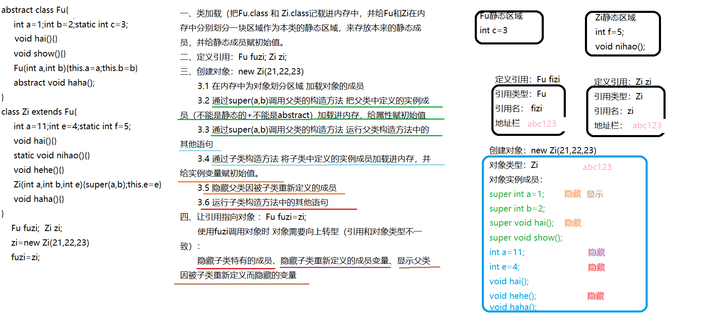


## 接口 关键字interface

当一个类的所有方法都是抽象方法时，这个类就变成了接口。

类抽象到极致就是接口。

特点：

1、成员变量默认修饰符：public static final ,也就是说接口的变量必须在定义时初始化，或者在静态代码块中初始化。

2、成员方法默认修饰符：public abstract。

3、类继承接口变为类实现接口，实现关键字implements。

4、java支持**类可以同时实现多个接口，同时不影响继承父类**

class A impents B,C,D extends E{}

5、**接口没有构造方法**。

6、和抽象方法一样，接口的实现类必须实现所有的抽象方法，否则实现类是抽象类。

7、**接口与接口之间是多继承**。

接口的作用：

定义引用，指向的是实现类对象，使用多态；为实现类定义规范。


## 抽象类与接口的区别

相同之处：

1、都可以有抽象方法

2、都只能定义引用、不能创建对象

3、都是为子类或者实现类定义规范

不同之处：

1、抽象类有构造方法，接口没有构造方法

2、抽象类中可由有普通方法，接口中必须都是抽象方法

3、抽象类中可以有任意类型变量和方法，接口中只能有public static final 的变量和抽象方法。

4、抽象类是类，只能单继承extents。接口与接口时多继承，接口与类是多实现implements并且不影响其子类的单继承。

# mysql数据库

数据库：database --db 存储数据的仓库

数据库管理系统： database manager system : dbms 对数据库进行管理的软件

关系型数据库管理系统：relational database manager system：rdbms 以**二维表**的形式管理数据

数据库管理员： database adminstrator：dma 

## 数据库分类

按模型分类：

1、网状模型：每个数据用一个节点表示，每个节点与其他节点都有联系，这样数据库中所有数据节点就构成了一个复杂的网络。

使用场景：社交软件的客户关系

缺点：增删改查比较麻烦

2、层次模型：

以树形层次结构组织数据，存在根节点即叶子节点，有明确的上下级关系。

使用场景：数据有明确的上下级关系。

3、关系模型：

以二维表存储数据。

二维分别是 行 和 列：

行：一条数据，类似于java中的对象

列：一个字段，类似于java中的属性

表（table）：封装所有的字段，类似于java中的类

数据库（database）：存储同一个项目的所有表，类似于java中的package

## 常见的数据库

mysql：

oracle：

slqserver：

access：

DB2：

redis:

mangodb:

hbase:

# java（Java虚拟机）中内存的划分

Java源代码执行时会调用编译器（Java Compiler）进行编译，将.java的源文件编译为.class的可执行文件，然后调用类加载器（Class Loader）将可执行文件进行类加载，加载完毕后就交由JVM执行引擎执行。在执行期间虚拟机会划分一小段空间来存储执行期间需要用到的数据和相关信息，这段空间就被称为运行时数据区（Runtime Data Area），一般说的java内存就是指的这段区域，内存分配和垃圾回收等管理内存的指的也是对这段空间的管理。

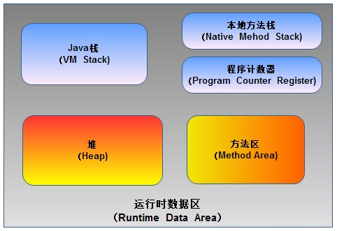

运行时数据区包括哪几部分？

**程序计数器**（Program Counter Register）：和CPU中的寄存器类似，里面保存的是程序当前执行的指定地址，当CPU需要执行指定时，需要从程序计数器中获取当前指令的地址，然后根据得知获取到指定。在得到指定之后，程序计数器会自动加1或者转意指针到下一条指定的地址，如此循环直到执行完所有的指令。由于在JVM中，多线程是通过轮流切换来获取CPU执行时间的，因此，在任意一个具体时刻，一个CPU内核只会执行一条线程。为了能使每个线程在线程切换后能后恢复到切换之前的程序的执行位置，每个线程都应该有一个独立的程序计数器，他们互相独立互不干扰，否则就会应先搞程序的执行次序。因此程序计数器在每个线程中是私有的。

> 在JVM规范中规定，如果线程执行的是非native方法，程序计数器中保存的是当前需要执行的指定的地址；如果线程执行的是native方法，程序计数器中保存的值是undefined。
>
> 由于程序计数器中存储的数据不会随着程序的执行而发生改变（因为一直都是32位地址值），所以不会发生内存溢出（OutOfMemory）现象。

**Java栈**（VM Stack）：

又称虚拟机栈，也就是常说的栈。Java栈是Java方法执行的内存模型，方法的所有内容都在Java栈中。Java栈中存放的一个个的栈帧，每个栈帧对应一个被调用的方法，栈帧分为五部分：

1、局部变量表（Loval Variables）：存储方法中的局部变量（包括方法中声明的非静态变量以及函数形参），对于基本数据类型的变量存储的是它的值，引用数据类型的变量则存储的是它的引用。局部变量表的大小在编译器中就确定了，因此在程序执行期间局部变量表的大小是不会改变的。

2、操作数栈（Operand Stack）：和局部变量表一样，都是以字长为单位的数组。但是局部变量表用的是索引访问，操作数栈是弹栈/压栈访问。程序中的所有计算过程都借助操作数栈完成。

3、指向运行时常量池的引用（Reference to runtime constant pool）：因为在执行方法时有可能需要用到常量池里的常量，所以要有一个指向常量池的引用。

4、方法返回地址（Return Address）：当方法执行完之后，指针要返回到执行该方法之前的地方，所以在栈帧中要有一个方法返回地址。

5、附加信息：

当线程执行一个方法时，就会随之创建一个对应的栈帧，并将建立的栈帧压入栈。当方法执行完毕后就会将该栈帧出栈。所以，线程当前执行的方法必定在栈的顶部，这也是为什么递归容易导致栈内存溢出的原因，也是栈区空间不用我们去管理的原因，这部分空间的分配和释放都是由系统自动实施的。

由于每个线程正在执行的方法可能不同，因此每个线程都有属于自己的Java栈，互不干扰。

**本地方法栈**（Native Method Stack）：和Java栈相似，只是本地方法栈是专门为执行本地方法（Native Method）服务的，而Java栈是为执行Java方法服务的。在JVM规范中并没有对本地方法栈的具体实现以及数据结构作强制规定，虚拟机可以自由实现它。在HotSopt虚拟机中直接就把本地方法栈和Java栈合为一体。

**堆**（Heap）：Java中的堆是用来存储对象本身以及数组的（数组引用仍然是存放在Java栈中）。Java的垃圾回收机制会自动处理空间释放的问题。堆是被所有线程共享的，在JVM中只有一个堆。

**方法区**（Method Area）：和堆一样也是被线程共享的区域。在方法区中存储了存储了每个类的信息（包括类的名称、方法信息、字段信息）、静态变量、常量以及编译器编译后的代码等。在方法区中还有一个重要的区域就是运行时常量池，它是每一个类或接口的常量池的运行时表示形式，在类和接口被加载到JVM后，对应的运行时常量池就被创建出来。当然不是Class文件中的内容也是可以进入到运行时常量池的，比如String的intern方法。String.intern()：将字符串添加到常量池中，并返回指向该常量分引用。


补充：在JVM规范中，没有强制要求方法区必须实现垃圾回收。很对人习惯将方法区称为“永久代”，是应为HotSpot虚拟机以永久代来实现方法区，从而JVM的垃圾收集器可以像管理堆区一样管理部分区域，从而不需要专门为这部分设计垃圾回收机制。不过自JDK7之后，Hotspot虚拟机将运行时常量池从永久代中移除了。

## 新生代、老年代、永久代

**一、新生代**

　　新生代主要用来存放新生的对象。一般占据堆空间的1/3。在新生代中，保存着大量的刚刚创建的对象，但是大部分的对象都是朝生夕死，所以在新生代中会频繁的进行MinorGC，进行垃圾回收。新生代又细分为三个区：Eden区、SurvivorFrom、ServivorTo区，三个区的默认比例为：8：1：1。

-  **Eden区：**Java新创建的对象绝大部分会分配在Eden区（如果对象太大，则直接分配到老年代）。当Eden区内存不够的时候，就会触发MinorGC（新生代采用的是复制算法），对新生代进行一次垃圾回收。
- **SurvivorFrom区和To区：**在GC开始的时候，对象只会存在于Eden区和名为From的Survivor区，To区是空的，一次MinorGc过后，Eden区和SurvivorFrom区存活的对象会移动到SurvivorTo区中，然后会清空Eden区和SurvivorFrom区，并对存活的对象的年龄+1，如果对象的年龄达到15，则直接分配到老年代。MinorGC完成后，SurvivorFrom区和SurvivorTo区的功能进行互换。下一次MinorGC时，会把SurvivorTo区和Eden区存活的对象放入SurvivorFrom区中，并计算对象存活的年龄。

**二、老年代**

　　老年代主要存放应用中生命周期长的内存对象。老年代比较稳定，不会频繁的进行MajorGC。而在MaiorGC之前才会先进行一次MinorGc，使得新生的对象进入老年代而导致空间不够才会触发。当无法找到足够大的连续空间分配给新创建的较大对象也会提前触发一次MajorGC进行垃圾回收腾出空间。

　　在老年代中，MajorGC采用了标记—清除算法：首先扫描一次所有老年代里的对象，标记出存活的对象，然后回收没有标记的对象。MajorGC的耗时比较长。因为要扫描再回收。MajorGC会产生内存碎片，当老年代也没有内存分配给新来的对象的时候，就会抛出OOM（Out of Memory）异常。

 

**三、永久代**

　　永久代指的是永久保存区域。主要存放Class和Meta（元数据）的信息。Classic在被加载的时候被放入永久区域，它和存放的实例的区域不同，在Java8中，词锋代已经被移除，取而代之的是一个称之为“元数据区”（元空间）的区域。元空间和永久代类似，都是对JVM中规范中方法的实现。不过元空间与永久代之间最大的区别在于：元空间并不在虚拟机中，而是使用本地内存。因此，默认情况下，元空间的大小仅受本地内存的限制。类的元数据放入native memory，字符串池和类的静态变量放入java堆中。这样可以加载多少类的元数据就不再由MaxPermSize控制，而由系统的实际可用空间来控制。

采用元空间而不用永久代的原因：

- 为了解决永久代的OOM问题，元数据和class对象存放在永久代中，容易出现性能问题和内存溢出。
- 类及方法的信息等比较难确定其大小，因此对于永久代大小指定比较困难，大小容易出现永久代溢出，太大容易导致老年代溢出（堆内存不变，此消彼长）。
- 永久代会为GC带来不必要的复杂度，并且回收效率偏低。

## 垃圾回收


## js的九大内置对象

四个作用域对象：Request、Session、Page、Application

输出：Out

响应：Response

上下文：PageContext

异常：Exception

配置：Config

# 集合

首先就是**，集合和数组的区别**：

1、长度可变性：数组定义时需要指定长度，长度不可变；集合定义时不需要指定长度，长度可变。

2、存放的数据类型：数组可以存放基本数据类型的数据也可以存放引用数据类型的数据；集合只能存放引用数据类型的数据（但是基本数据类型可以自动装箱为引用数据类型，然后存进去）。

3、元素类型：数组在定义时需要指定元素类型，定义后数组只能存放该数据类型的数据；集合定义时可以不指定数据类型，可以存放不同引用数据类型的数据。

#### 集合分类

**Collection** 单列集合的顶层接口 
├——-**List** 接口：元素按进入先后有序保存；可重复；可以通过索引直接获取元素get(index)
│—————-├ **LinkedList** 接口实现类， 链表， 插入删除， 没有同步， 线程不安全
│—————-├ **ArrayList** 接口实现类， 数组， 随机访问， 没有同步， 线程不安全
│—————-└ **Vector** 接口实现类 数组， 同步， 线程安全
│ ———————-└ **Stack** 是**Vector**类的实现类，是一个先进后出的栈
└——-**Set** 接口： 无序；不可重复；不能通过索引获取元素
├—————-└**HashSet**  Set的实现类 使用hash表（数组）存储元素
│————————└ **LinkedHashSet ** 是HashSet的子类 链表，维护元素的插入次序
└ —————-**TreeSet**  实现类 底层实现为二叉树，元素排好序

**Map** 双列集合的顶层接口，存放的是键值对
├———**Hashtable** 接口实现类， 同步， 线程安全
├———**HashMap** 接口实现类 ，没有同步， 线程不安全-
│—————–├ **LinkedHashMap** 双向链表和哈希表实现
│—————–└ **WeakHashMap**
├ ——–**TreeMap** 红黑树对所有的key进行排序
└———**IdentifyHashMap**

## Collection集合的方法

1、boolean add(E e)								 在集合末尾添加元素

2、boolean remove(Object o)				若集合中有元素o则删除o并返回true，否则返回false

3、void clear()											清空集合，执行此方法后集合为空

4、boolean contains（Object o）			判断集合中是否包含元素o，有返回true，无返回false

5、boolean isEmpty（）							判断集合是否为空，是true，不是false

6、int size（）											返回集合中元素的个数

7、boolean addAll（Collection c）			将集合c的所有元素添加到该集合中

8、Object[] toArray()									返回一个包含了该集合所有元素的数组，数组类型为Object[]

9、Iteartor iteartor（）								迭代器，集合的专用遍历方式

#### List

1、ArrayList：		底层数据结构是数组，查询快，增删慢，线程不安全，效率高，可以存储重复元素。

特有的功能：没有，但是他最常用

2、LinkedList：底层数据结构是双向链表，查询慢，增删快，线程不安全，效率高，可以存储重复元素。

特有的功能：

1）添加：addFirst()   addLast()

2）删除：removeFirst()   removeLast()

3）获取：getFirst（）  getLast（）

这些方法可以实现将LinkedList作为堆栈或队列使用。

3、Vector：				底层数据结构是数组，查询快，增删慢，线程安全，效率低，可以存储重复元素。

特有功能：

1）addElement（E obj）  相当于add（）

2）elementAt（int index）相当于get（）

3)  Enumeration<E> elements()   迭代器

#### Set

1、**HashSet**：底层数据结构是用哈希表实现的，是数组和链表，元素无序且唯一，线程不安全，效率高，可以存储null元素。元素的唯一性是靠所存储元素类型是否重写hashCode()和equals()方法来保证的，如果没有重写这两个方法，则无法保证元素的唯一性。HashSet的底层是HashMap，用的HashMap的Key来存储数据，Value是final修饰的静态Object类型的present，present是一个空的Object对象。

具体实现唯一性的比较过程：存储元素首先会使用hash()算法函数生成一个int类型hashCode散列值，然后和已经存储的元素的hashCode值比较，如果hashCode不相等，则所存储的两个对象一定不相等，此时存储当前的新的hashCode值处的元素对象；如果hashCode相等，存储元素的对象还是不一定相等，此时会调用equals()方法判断两个对象的内容是否相等，如果返回true，那么就是同一个对象，无需存储；如果返回false，那么就是不同的对象，就该存储了，此时就要采用哈希的**解决地址冲突算法**，在当前hashCode值处类似一个新的链表， 在同一个hashCode值的后面位置存储不同的对象，这样就保证了元素的唯一性。.

Set添加数据时调用add（）方法，实际上是在底层调用Map的put（）方法，先使用hashcode（）方法得出int类型的hash散列值，如果hash值不相等，说明不是同一对象，直接加进去；如果hash值相同，再调用equals方法判断，如果返回true，则不加，返回false，就在该hach值位置处创建一个链表，链表中装hash值相同equals判断为fals的数据；如果链表长度等于8时，该集合会进行扩容为2倍，如果集合长度为64时，链表会变成红黑树。

重写HashCode（）方法的原则：

1）一定要让那些我们认为相同的对象返回相同的hashCode值
2）尽量让那些我们认为不同的对象返回不同的hashCode值，否则，就会增加冲突的概率。
3）尽量的让hashCode值散列开（两值用异或运算可使结果的范围更广）

2、**LinkedHashSet**：是HashSet的子类，底层数据结构是链表和哈希表共同实现的，链表保证了元素的顺序与存储顺序一致，哈希表保证了元素的唯一性。线程不安全，效率高。

3、**TreeSet**：底层数据结构是二叉树，元素唯一且已经排好序；**实现排序的方式是add元素的时候底层其实调用的map的put方法，在put的时候会将进来的元素按左子树比右子树小的规则放置。**唯一性同样需要重写hashcode（）和equals（），二叉树保证了元素的有序性。根据构造方法不同，分为自然排序（无参构造）和比较器排序（有参构造），自然排序要求元素必须实现Compareable接口，并重写里面的compareTo（）方法，元素通过比较返回的int值来判断排序序列，返回0说明两个对象相同，不需要存储；比较器需要在TreeSet初始化的时候传入一个实现Comparator接口的比较器对象，或者采用匿名内部类的方式new一个Comparator对象，重写里面的compare()方法；

总结：Set具有和Collection完全一样的接口，因此没有任何额外的功能。实际上set就是collection，只是行为不同，这是继承与多态的典型应用。set不保存重复的元素。

### List和Set总结

（1）List,Set都是继承自Collection接口，Map则不是
（2）List特点：元素有放入顺序，元素可重复 ，Set特点：元素无放入顺序，元素不可重复，重复元素会覆盖掉，（注意：元素虽然无放入顺序，但是元素在set中的位置是有该元素的HashCode决定的，其位置其实是固定的，加入Set 的Object必须定义equals()方法 ，另外list支持for循环，也就是通过下标来遍历，也可以用迭代器，但是set只能用迭代，因为他无序，无法用下标来取得想要的值。）
（3）Set和List对比：
Set：检索元素效率低下，删除和插入效率高，插入和删除不会引起元素位置改变。
List：和数组类似，List可以动态增长，查找元素效率高，插入删除元素效率低，因为会引起其他元素位置改变。
（4）ArrayList与LinkedList的区别和适用场景
Arraylist：
优点：ArrayList是实现了基于动态数组的数据结构,因为地址连续，一旦数据存储好了，查询操作效率会比较高（在内存里是连着放的）。
缺点：因为地址连续， ArrayList要移动数据,所以插入和删除操作效率比较低。

LinkedList：
优点：LinkedList基于链表的数据结构,地址是任意的，所以在开辟内存空间的时候不需要等一个连续的地址，对于新增和删除操作add和remove，LinedList比较占优势。LinkedList 适用于要头尾操作或插入指定位置的场景
缺点：因为LinkedList要移动指针,所以查询操作性能比较低。
适用场景分析：
当需要对数据进行多次访问的情况下选用ArrayList，当需要对数据进行多次增加删除修改时采用LinkedList。

### ArrayList和Vector的区别

ArrayList有三个构造方法：

~~~ java
public ArrayList(int initialCapacity)//构造一个具有指定初始容量的空列表。    
public ArrayList()      //默认构造一个初始容量为10的空列表。    
public ArrayList(Collection<? extends E> c)//构造一个包含指定 collection 的元素的列表
~~~

Vector有四个构造方法：

~~~ java
public Vector()//使用指定的初始容量和等于0的容量增量构造一个空向量。    
public Vector(int initialCapacity)//构造一个空向量，使其内部数据数组的大小，其标准容量增量为零。    
public Vector(Collection<? extends E> c)//构造一个包含指定 collection 中的元素的向量    
public Vector(int initialCapacity,int capacityIncrement)//使用指定的初始容量和容量增量构造一个空的向量 
~~~

ArrayList和Vector都是用数组实现的，主要有这么三个区别：
（1）Vector是多线程安全的，线程安全就是说多线程访问同一代码，不会产生不确定的结果。而ArrayList不是，这个可以从源码中看出，Vector类中的方法很多有synchronized进行修饰，这样就导致了Vector在效率上无法与ArrayList相比；
（2）两个都是采用的线性连续空间存储元素，但是当空间不足的时候，两个类的增加方式是不同。**Arraylist扩容时，默认增长0.5倍；Vector扩容时默认增长1倍。**
*（3）*Vector可以设置增长因子，而ArrayList不可以。
*（4）*Vector是一种老的动态数组，是线程同步的，效率很低，一般不赞成使用。
适用场景分析：
1.Vector是线程同步的，所以它也是线程安全的，而ArrayList是线程异步的，是不安全的。如果不考虑到线程的安全因素，一般用ArrayList效率比较高。
2.如果集合中的元素的数目大于目前集合数组的长度时，在集合中使用数据量比较大的数据，用Vector有一定的优势。

### HashSet和TreeSet的区别

1.TreeSet 是二叉树（红黑树的树数据结构）实现的,TreeSet中的数据是自动排好序的，不允许放入null值
2.HashSet 是哈希表实现的,HashSet中的数据是无序的，可以放入null，但只能放入一个null，两者中的值都不能重复，就如数据库中唯一约束
3.HashSet要求放入的对象必须实现HashCode()方法，放入的对象，是以hashcode码作为标识的，而具有相同内容的String对象，hashcode是一样，所以放入的内容不能重复。但是同一个类的对象可以放入不同的实例

适用场景分析:HashSet是基于Hash算法实现的，其性能通常都优于TreeSet。为快速查找而设计的Set，我们通常都应该使用HashSet，在我们需要排序的功能时，我们才使用TreeSet。


## Map

Map用于保存具有映射关系的数据，Map里保存着两组数据：key和value，它们都可以使任何引用类型的数据，但key不能重复。所以通过指定的key就可以取出对应的value。

注意：Map没有继承Collection接口，它和Collention接口平级。一个 Map 中不能包含相同的 key ，每个 key 只能映射一个 value 。 Map 接口提供 3 种集合的视图， Map 的内容可以被当作一组 key 集合，一组 value 集合，或者一组 key-value 映射。

#### Map主要方法：

void clear（）：											清空集合

boolean	containsKey（Object	key）：  查询Map中是否包含指定key，如果包含则返回true，否则返回false

boolean	containsValue（Object	value）：查询Map中是否包含指定value，如果包含则返回true，否则返回false

Set entrySet（）：返回Map中所包含的键值对所组成的Set集合，每个集合元素都是Map.Entry对象（Entry是Map的内部类）

Object	get（Object	key）：返回指定key所对应的value，如果没有指定key则返回null

boolean isEmpty（）：

Set	keySet（）：返回Map中所有key组成的set集合

Collection	values（）：返回该Map中所有value组成的Collection集合

Object	put（Object	key，Object	value）：添加一个键值对，如果已有该key，则用新value覆盖该key对应的value

void	putAll（Map m）：将指定Map中的键值对全部复制到该Map中

Object	remove（Object	key）：删除指定key对应的键值对，返回该key关联的value，如果key不存在，返回null

int	size（）：返回该Map里的键值对个数

内部类Entry：

Object	getKey（）：返回该Entry里包含的key值

Object	getValue（）：返回该Entry里包含的value值

Object	setValue（）：设置该Entry里包含的value值，并返回新设置的value值

### HashMap和HashTable的比较

HashMap初始化容量为16，默认加载因子是0.75，也就是集合用量达到容量的百分之75之后就进行扩容，扩容大小为原来容量的2倍。

HashTable初始化容量为11，扩容是原容量的2倍+1。

##### 为什么要有扩容因子

当进行多线程操作时，有可能会一下子加入好几条数据，造成瞬间的空间够的问题。

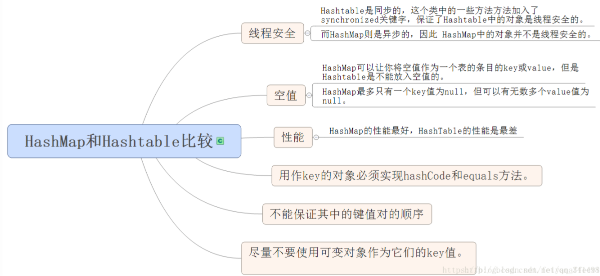

### TreeMap：


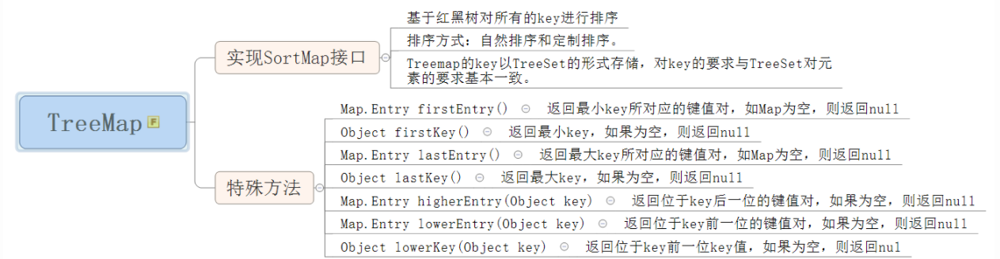

### Map的其它类

IdentityHashMap和HashMap的具体区别，IdentityHashMap使用 == 判断两个key是否相等，而HashMap使用的是equals方法比较key值。有什么区别呢？
对于==，如果作用于基本数据类型的变量，则直接比较其存储的 “值”是否相等； 如果作用于引用类型的变量，则比较的是所指向的对象的地址。
对于equals方法，注意：equals方法不能作用于基本数据类型的变量
如果没有对equals方法进行重写，则比较的是引用类型的变量所指向的对象的地址；
诸如String、Date等类对equals方法进行了重写的话，比较的是所指向的对象的内容。

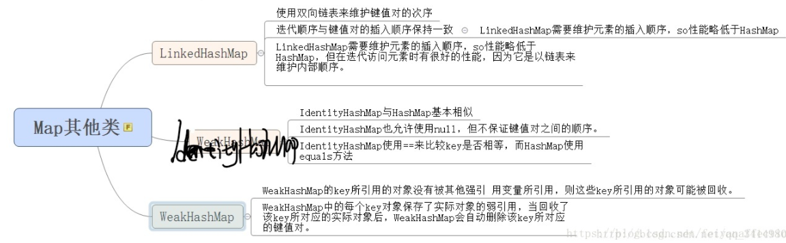

### Map总结

HashMap 非线程安全
HashMap：基于哈希表实现。使用HashMap要求添加的键类明确定义了hashCode()和equals()[可以重写hashCode()和equals()]，为了优化HashMap空间的使用，您可以调优初始容量和负载因子。

TreeMap：非线程安全基于红黑树实现。TreeMap没有调优选项，因为该树总处于平衡状态。

适用场景分析：
HashMap和HashTable:HashMap去掉了HashTable的contains方法，但是加上了containsValue()和containsKey()方法。HashTable同步的，而HashMap是非同步的，效率上比HashTable要高。HashMap允许空键值，而HashTable不允许。

HashMap：适用于Map中插入、删除和定位元素。
Treemap：适用于按自然顺序或自定义顺序遍历键(key)。

线程安全的Map：

HashTable

**SynchronizedMap**:它其实就是加了一个对象锁，每次操作hashmap都需要先获取这个对象锁，这个对象锁有加了synchronized修饰，锁性能跟hashtable差不多。

**ConcurrentHashMap**

这个是目前使用最多，而且也是最推荐的一个集合，实现也是比较复杂的一个。我们看源码其实是可以发现里面的线程安全是通过cas+synchronized+volatile来实现的，其中也可看出它的锁是分段锁，所以它的性能相对来说是比较好的。整体实现还是比较复杂的。

### 线程安全集合类与非线程安全集合类

LinkedList、ArrayList、HashSet是非线程安全的，Vector是线程安全的;
HashMap是非线程安全的，HashTable、SynchronizedMap、ConcurrentHashMap是线程安全的;
StringBuilder是非线程安全的，StringBuffer是线程安全的。

### 数据结构

ArrayXxx:底层数据结构是数组，查询快，增删慢
LinkedXxx:底层数据结构是链表，查询慢，增删快
HashXxx:底层数据结构是哈希表，也是就数组和链表。依赖两个方法：hashCode()和equals()
TreeXxx:底层数据结构是二叉树。两种方式排序：自然排序和比较器排序

### 红黑树

Red—Black Tree，是一种特殊的二叉查找树红黑树的每个节点上都有存储位表示节点的颜色，可以是红(Red)或黑(Black)。

**红黑树的特性**:

**（1）每个节点或者是黑色，或者是红色。**
**（2）根节点是黑色。**
**（3）每个叶子节点（NIL）是黑色。 [注意：这里叶子节点，是指为空(NIL或NULL)的叶子节点！]**
**（4）如果一个节点是红色的，则它的子节点必须是黑色的。**
**（5）从一个节点到该节点的子孙节点的所有路径上包含相同数目的黑节点。**

**注意**：
(01) 特性(3)中的叶子节点，是只为空(NIL或null)的节点。
(02) 特性(5)，确保没有一条路径会比其他路径长出俩倍。因而，红黑树是相对是接近平衡的二叉树。

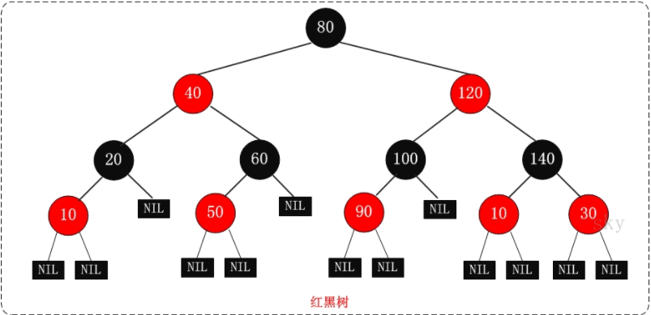

红黑树的应用比较广泛，主要是用它来存储有序的数据，它的时间复杂度是O(lgn)，效率非常之高。
例如，Java集合中的[TreeSet](http://www.cnblogs.com/skywang12345/p/3311268.html)和[TreeMap](http://www.cnblogs.com/skywang12345/p/3310928.html)，C++ STL中的set、map，以及Linux虚拟内存的管理，都是通过红黑树去实现的。

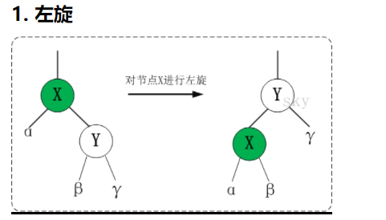

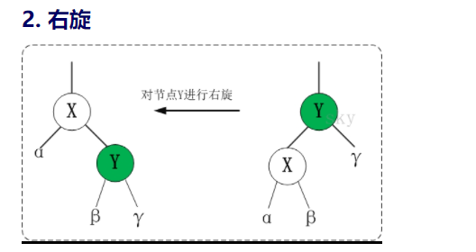

